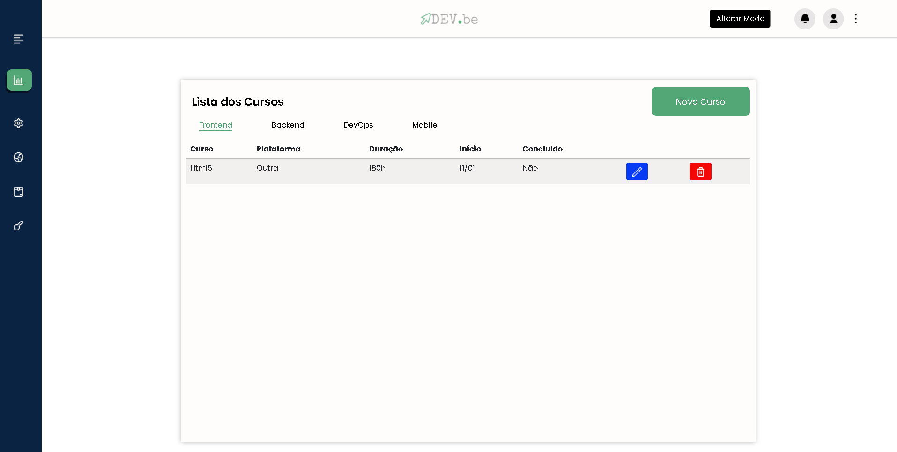

# Desafio Mentoria - CRUD

Atráves de uma mentoria, foi passado o desafio de criar uma lista onde é possível alterar, deletar e cadastrar. 

Criei um layout onde seria um dev colocando seus cursos com campos de Nome, Plataforma, Duração, Início e se foi Concluído.



## 🚀 Começando

Desafio com prazo de entrega de 1 semana.


### 🔧 Instruções do desafio 

Implementar uma lista de itens carregados de uma API
```

CSS a partir de alguma biblioteca 
```

Melhora de layout
```

Commits com verbos infinitivos 
```

READEme mais detalhado 
```

Dark Mode
```

Prototipo inicial com Figma
```

## 🛠️ Construído com

* Bootstrap - biblioteca 
* Local Storage - para armazenar dados da tabela
* JavaScript - interação com os dados e o HTML 

Optei por usar o localstorage para armazenar os dados para ter uma experiência a mais com o JavaScript.

## ✒️ Autora

⌨️ com ❤️ por [becardine](linkedin.com/in/becardine/)

## 🎁 Expressões de gratidão

* Se você chegou até aqui, muito obrigada 📢

[⬆ Voltar ao topo](#desafio-crud)<br>

